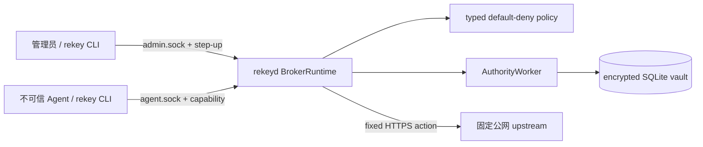

# Rekey v2 架构基线

## 当前系统边界

系统是单机、单 authority、单 durable writer。`rekeyd` 同时承载 IPC、session、policy、固定动作
执行与响应封印；AuthorityWorker 独占 SQLite connection、VRK、credential mutation 和审计提交。
CLI 只是 IPC client，不链接 SQLite、crypto、HTTP transport、vault 或 broker 实现。

## 组件与所有权

| 组件 | 职责 | 明确不拥有 |
| --- | --- | --- |
| `rekey-domain` | 纯模型、不变量、typed errors、IPC codec | IO、secret store、HTTP |
| `rekey-policy` | canonical policy snapshot、schema、default-deny evaluator | credential IO、session 状态 |
| `rekey-vault` | envelope crypto、SQLite、bootstrap、AuthorityWorker | Agent socket、任意 HTTP |
| `rekey-broker` | 双 UDS、session、policy activation、Action executor、sealing | 第二个 durable writer |
| `rekey-cli` | 管理员/Agent 命令与安全输入通道 | crypto、SQLite、HTTP、secret cache |

## 执行数据流

1. 管理员通过 `admin.sock` 逐次提供 step-up proof，创建 credential、Action 和 session，并激活
   canonical typed policy snapshot。
2. Agent 向 `agent.sock` 提交 action version、capability 和有界 body；它不能提交 destination 或
   auth material。
3. Broker 校验 peer、frame、capability、policy、限额和固定 Action，先提交
   `execution.started`。
4. AuthorityWorker 只为该次执行产生 consume-once `PreparedCredential`；Broker 构造固定 HTTPS
   request，关闭 redirect 和 proxy environment，并 pin 已筛选公网 endpoint。
5. 完整有界响应经过 header filter 与 secret sealing 后才返回 Agent；任何失败都返回 typed error，
   不降级为不安全路径。

## 部署档位

| 档位 | 条件 | 可声明范围 |
| --- | --- | --- |
| 默认 G1 | broker、管理员和 Agent 可能属于同一 OS 用户 | 防 Agent API/协议层取密和越权；不防同用户直接取证 |
| Linux G2 reference | 不同 UID、PID/filesystem/network namespace、仅共享受控 Agent UDS，且攻击 harness 通过 | 只对该参考拓扑的 uid/pid/ptrace/state/admin socket/direct egress 等检查成立 |

Linux G2 不是默认安装结果，也不是对 root、kernel、Docker daemon 或所有容器平台的认证。

## 持久化与恢复

vault 使用 format version 4、SQLite WAL、`synchronous=FULL` 和 STRICT tables。Credential 采用
Argon2id/HKDF、VRK、per-version DEK、AES-256-GCM 与二进制 AAD 的 envelope hierarchy。
Backup 使用 SQLite Online Backup API；restore 只接受带 receipt SHA-256 的 v4 artifact，并通过
marker、staging、完整 payload 解密验证、fsync 和 rename 控制 crash 边界。

## 采用、适配与自建决策

- 采用：SQLite、rustls、Argon2id、HKDF、AES-GCM 和操作系统 UDS/peer credentials，避免自建
  数据库、TLS 或密码学原语。
- 自建：Credential Authority 的固定动作协议、capability、typed policy、审计顺序和响应封印，
  因为这些共同构成 Rekey 的最小安全边界。
- 拒绝：继续适配 v1 MITM/透明代理、通用 provider registry、兼容迁移层或把外部 Secret Manager
  设为 Community 前置依赖；这些都扩大当前攻击面，且不属于已声明场景。

## 未实现的企业能力

当前没有 tenant key、租户隔离查询、SSO/SCIM、远程控制面、HA、split-brain 协议、多区域、
集中审计服务或企业 SLA。文档中的“企业架构”只定义当前边界与未来承诺禁区，不代表这些能力
已经设计或交付。
